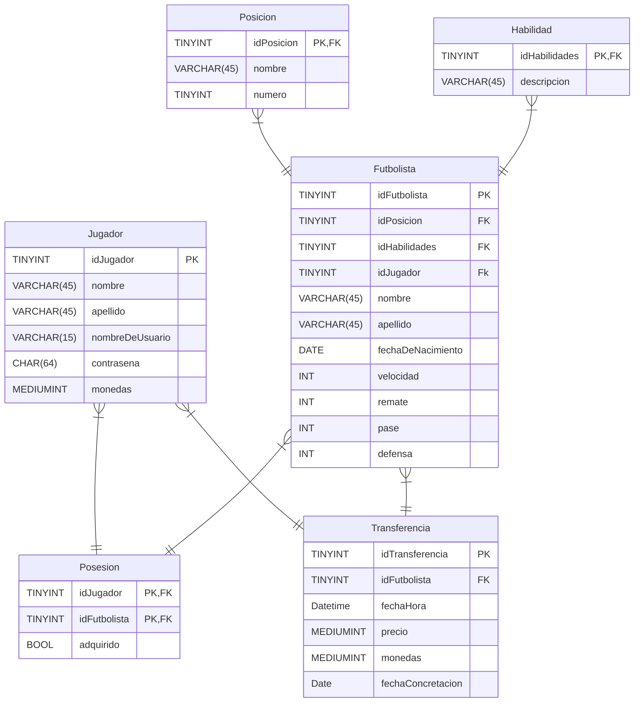

-- CREAR UNA TABLA EN MEDIO DE FUTBOLISTA Y HABILIDADES PARA ROMPER EL "MUCHOS A MUCHOS", 

- Nombre de las posiciones dentro de la cancha.

- Nombre de las habilidades y una descripción (no más de 45        caracteres).

- De los futbolistas importa conocer nombre, apellido, fecha de nacimiento, velocidad, remate, pase, defensa (valores enteros entre 1 y 100). Cada jugador tiene una posición en la cancha y puede tener múltiples habilidades (o ninguna).

- De los jugadores (jugadores reales del juego) importa conocer su nombre, apellido, nombre de usuario (único, máximo de 15 letras) contraseña (64 caracteres de longitud fija) y cantidad de monedas (positivo o cero, valor máximo 999.999). 

- Posesión de futbolistas por jugadores (un jugador puede tener muchos futbolistas y el mismo futbolista puede pertenecer a varios jugadores).

- De las transferencias importa conocer fecha y hora de publicación, jugador que ofrece un futbolista y precio en monedas. Cuando la transferencia es exitosa se termina de asignar fecha y hora transferencia y jugador comprador.
-Posesión de futbolistas por jugadores (un jugador puede tener muchos futbolistas y el mismo futbolista puede pertenecer a varios jugadores).
De las transferencias importa conocer fecha y hora de publicación, jugador que ofrece un futbolista y precio en monedas. Cuando la transferencia es exitosa se termina de asignar fecha y hora transferencia y jugador comprador.
